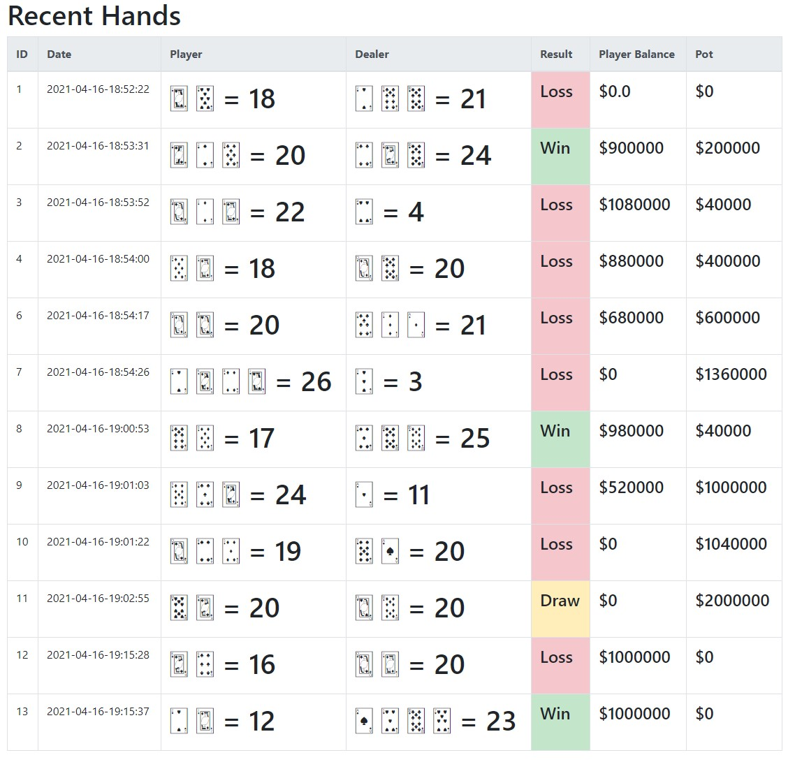

# Blackjack hands API
A REST API and simple interface for displaying the hands from my Blackjack Game

https://github.com/confy/blackjack



### Installation (Windows)

```
git clone https://github.com/confy/blackjack-api.git
cd blackjack-api
py -m venv venv
.\venv\Scripts\activate
pip install -r requirements.txt
py -m main
```